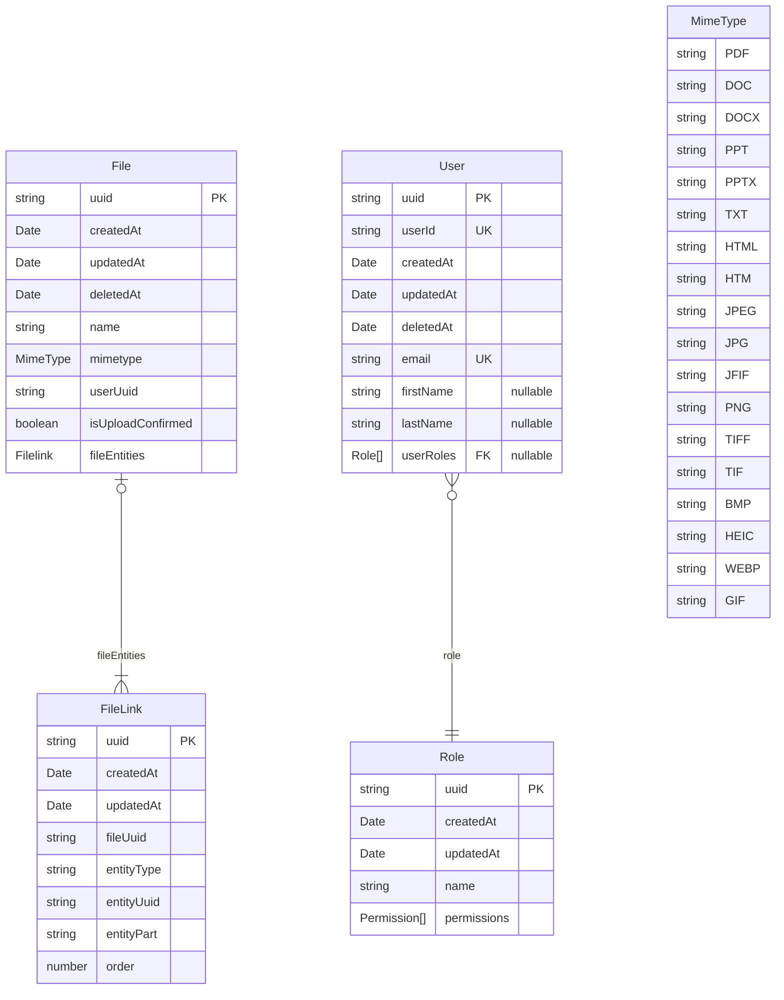

```mermaid
erDiagram
    File o|--|{ FileLink : fileEntities
    File {
        string uuid PK
        Date createdAt
        Date updatedAt
        Date deletedAt
        string name
        MimeType mimetype
        string userUuid
        boolean isUploadConfirmed
        Filelink fileEntities
    }
    FileLink {
        string uuid PK
        Date createdAt
        Date updatedAt
        string fileUuid
        string entityType
        string entityUuid
        string entityPart
        number order
    }

    User }o--|| Role : role

    User {
        string uuid PK
        string userId UK
        Date createdAt
        Date updatedAt
        Date deletedAt
        string email UK
        string firstName "nullable"
        string lastName "nullable"
        Role[] userRoles FK "nullable"
    }

    Role{
        string uuid PK
        Date createdAt
        Date updatedAt
        string name
        Permission[] permissions
    }


    MimeType {
      string PDF
      string DOC
      string DOCX
      string PPT
      string PPTX
      string TXT
      string HTML
      string HTM
      string JPEG
      string JPG
      string JFIF
      string PNG
      string TIFF
      string TIF
      string BMP
      string HEIC
      string WEBP
      string GIF
    }
```
